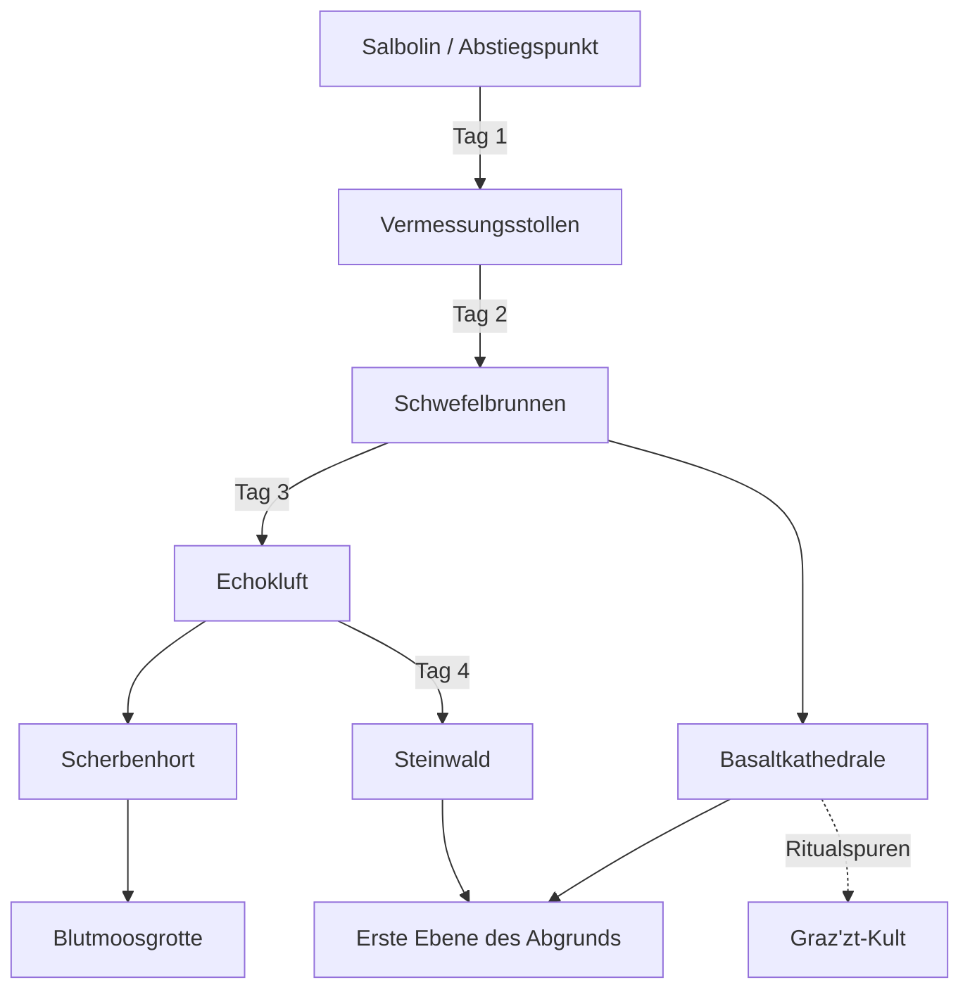

## Legende

- **Hauptweg zum Steinwald:** Salbolin → Vermessungsstollen → Schwefelbrunnen → Echokluft → Steinwald (**4 In-Game-Tage**)
- **Nebenrouten:** führen zu Loot, Ritualspuren oder erhöhtem Risiko
- **Abgrundnähe:** Basaltkathedrale und Steinwald haben gefährliche Verbindungen zur [[Erste Ebene des Abgrunds]]

## Reisezeiten (Richtwerte)

| Von                          | Nach                         |                  Dauer | Risiko        |        |
| ---------------------------- | ---------------------------- | ---------------------: | ------------- | ------ |
| [[Städte/Salbolin/Salbolin]] | [[Salbolin]] / Abstiegspunkt | [[Vermessungsstollen]] | 1 Tag         | Mittel |
| [[Vermessungsstollen]]       | [[Schwefelbrunnen]]          |                  1 Tag | Hoch (Umwelt) |        |
| [[Schwefelbrunnen]]          | [[Echokluft]]                |                  1 Tag | Mittel        |        |
| [[Echokluft]]                | [[Steinwald]]                |                  1 Tag | Hoch (Zerg)   |        |
| [[Echokluft]]                | [[Scherbenhort]]             |              0.5–1 Tag | Mittel        |        |
| [[Schwefelbrunnen]]          | [[Basaltkathedrale]]         |              0.5–1 Tag | Hoch          |        |
| [[Scherbenhort]]             | [[Blutmoosgrotte]]           |                0.5 Tag | Hoch          |        |
| [[Basaltkathedrale]]         | [[Erste Ebene des Abgrunds]] |                  1 Tag | Extrem        |        |
| [[Steinwald]]                | [[Erste Ebene des Abgrunds]] |               1–2 Tage | Extrem        |        |

## Ortsverknüpfungen

- [[Underdark]]
- [[Steinwald]]
- [[Echokluft]]
- [[Schwefelbrunnen]]
- [[Basaltkathedrale]]
- [[Scherbenhort]]
- [[Blutmoosgrotte]]
- [[Erste Ebene des Abgrunds]]
